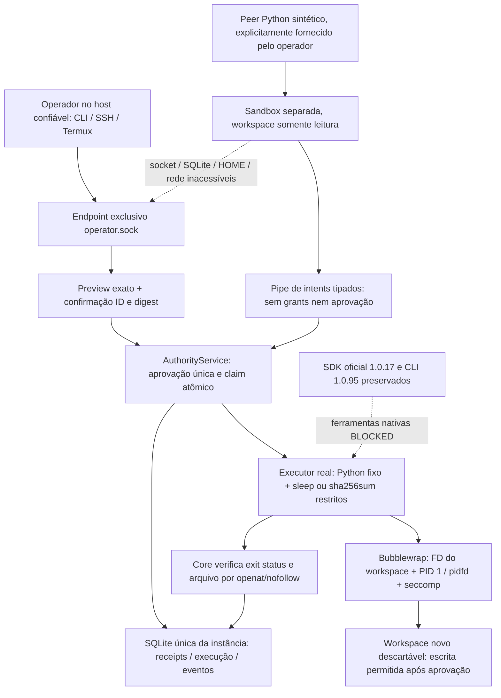
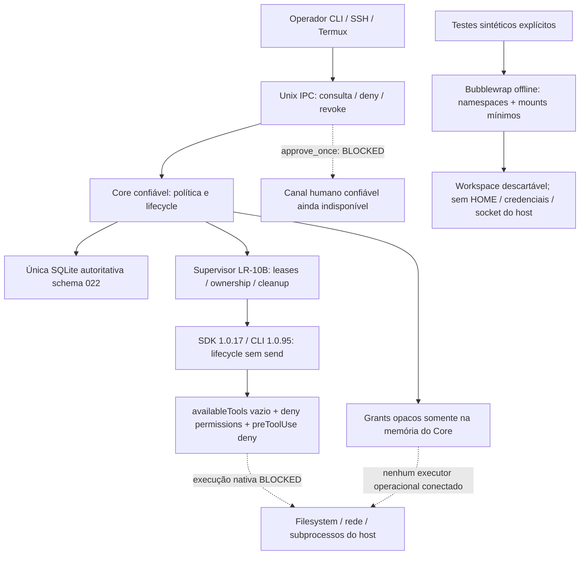

# LR-10C — Authority, Approval Policy, Sandbox & YOLO

## FIX-1 — Trusted Approval & Operational Boundary

**CANDIDATA PARA REAUDITORIA.** Esta seção descreve a correção do HEAD auditado
`e80943df2dd6c71ca927230167166c94da9281d2` e prevalece sobre o registro histórico
inicial abaixo. Não concede PASS final. O caminho **local offline** está conectado
a componentes executáveis do Core; Copilot autenticado e seus perfis continuam
BLOCKED/NOT_VERIFIED. Não há substituição do SDK oficial por um chatbot.

### Problemas e correções

1. HumanChannel existia apenas em fixtures: agora há um endpoint de operador
   exclusivo do modo `narys-core boundary-serve`, cujo domínio de confiança fica
   fora de todos os namespaces executáveis geridos por essa instância.
2. Request/approve/execute não tinham consumidor operacional: `local.rs` utiliza
   a mesma AuthorityService para request, aprovação exata e claim, com ferramenta
   Python real, escrita exclusiva de arquivo e verificação real por sha256sum.
3. Mutex global abrangia o efeito: claim transacional retorna um lease privado
   cancelável. Nenhum mutex global é mantido durante processos/read/wait. A
   publicação terminal usa seção curta e ordenada com cancelamento.

### Canal confiável: hipótese e prova delimitadas

O operador pertence ao domínio do host confiável. **UID, socket0600, TTY, texto
`trusted=true` e digest de confirmação não autenticam um humano.** O digest
apenas vincula a decisão ao preview. A separação é o boundary de OS obrigatório:
**todo código não confiável que essa instância admite**, incluindo o peer e
subprocessos, é lançado em namespaces separados; não há executor host-assisted
ou runtime nativo nessa instância. Peer só recebe pipes de intents/resultados.

Antes de registrar um peer, o Core executa preflight real: socket de operador,
marker privado sintético e `/proc` do Core inacessíveis; escrita no workspace
read-only falha; conexão ao listener TCP real do host falha; fd privados não
herdados; user namespaces adicionais não funcionam. Exige exit0 e cleanup por
wait/pidfd. Falha fecha admission, sem emitir approval positiva. Não existe um
campo wire ou variável de ambiente que emita esse certificado.

Core/CLI usam PR_SET_DUMPABLE=0; serve verifica o estado. Root/produtos privados,
SQLite e endpoint não são montados no agente. Não há credencial humana, challenge
secreto em argv/env, arquivo de grant, secret no workspace ou capability enviada
ao peer. Seccomp ainda impede sockets de qualquer família, ptrace, process_vm,
setns/unshare/mount, handles de filesystem, keyring, BPF, io_uring e interfaces
selecionadas. Filtro selado em memfd, instalado pelo Bubblewrap após setup,
herdado pelos descendentes; ABIs incompatíveis são recusadas. Não é uma allowlist
universal de syscalls nem prova contra bugs do kernel.

**Limite explícito:** isso não identifica humanos frente a um invasor com execução
arbitrária já no domínio confiável do host/conta, ou a outro agente lançado fora
dessa contenção. Não instalar esse endpoint no Core host-assisted, nem montar o
socket em ambientes agentivos. A IPC ordinária continua recusando approve_once.
A prova cobre subprocesso agentivo malicioso com mesmo UID **dentro do boundary
obrigatório desta instância**. Host comprometido/root/operador hostil permanecem
fora da garantia. Nenhuma declaração de origem altera essa separação.

Testes usam confirmação roteirizada pelo cliente real no domínio do operador.
Isso prova protocolo/isolamento, não a presença física de uma pessoa ou uma
conexão SSH real. CLI funciona sem monitor/GNOME; SSH/Termux executam o cliente no
host via sessão existente. Desconexão/reconexão do transporte de operador é testada
com sockets reais; o transporte SSH específico permanece NOT_VERIFIED.

### Contrato mínimo executável

`boundary-serve` é um modo explícito do **mesmo Core**, anterior a Config::discover,
sem acessar HOME, keyring ou serviço instalado. Só aceita root privado canônico
`/tmp/narys-boundary-NOME`; a única SQLite autoritativa dessa instância descartável
é `ROOT/db/luna.sqlite3`, usando Database e writer lease existentes. Não é segunda
base autoritativa do produto nem importação de dados pessoais. Não acompanha
conversa/TaskGraph de produção e não habilita sessão Copilot. Isso é uma prova
operacional local deliberadamente limitada, não a entrega agentiva Narys0.1.

Core cria TaskId durável em `agent_local_tasks`, sessão aleatória e workspace
novo. ID considera IDs persistidos existentes. O peer não escolhe TaskId,
sessão, especialista, perfil, workspace, versão de política ou TTL. O intent
estrito só aceita:

- `write`: criação exclusiva de um nome simples no workspace, conteúdo público
  ASCII com prefixo `NARYS_OFFLINE_TEST:`, até4096bytes; nenhum overwrite/delete.
- `command`: `/usr/bin/sha256sum` de um único `/workspace/NOME` regular sem
  symlink/hardlink, ou `/usr/bin/sleep` com um único inteiro0..30. Sem shell,
  argumentos gerais, git, rede, plugins, MCP ou extensão.

Todo intent exige aprovação, inclusive verificação. Contexto completo, path,
conteúdo exato, programa/argv/cwd, runner fixo e seu SHA256 aparecem como JSON
escapado no preview. O CLI exige `approve ID DIGEST` após mostrá-lo. Não aprova
argumento material oculto/redigido; strings fora do contrato são bloqueadas.
Nenhum conteúdo/argv bruto é gravado no audit ledger. O operador pode consultar,
negar/cancelar e observar expiry sem emitir um grant. Não há autorização de custo:
a admission independente só admite operações locais sem provider/rede/inferência.

A ferramenta usa código fixo Core, JSON por stdin e `O_EXCL|O_NOFOLLOW`. Mount usa
`--bind-fd`/`--ro-bind-fd`, não resolução tardia de path. Identidade dev/ino do
grant é comparada ao handle antes de enviar o efeito. Core retém esse mesmo
handle e verifica arquivos por openat/O_NOFOLLOW, regular/nlink1/limite de bytes,
conteúdo esperado e hash. Um teste real troca o path no host depois de abrir o
handle: efeito fica no inode original, não na substituição. Peer não pode modificar
o workspace antes de approval, nem alcançar o parent do mount. Não se promete
executor geral TOCTOU-safe para comandos arbitrários ou writers hostis no host.

Árvore/mountinfo rejeitam alias, devices, sockets, FIFOs, outros devices/submounts.
Montagens públicas são `/usr/bin`, `/usr/lib`, `/usr/lib64`, proc interno/dev mínimo
mais tmpfs privados; não monta `/usr/local`, `/usr/share`, /etc, HOME, DBus, SSH,
keyring ou banco. Quatro peers simultâneos, oito intents por peer,128tasks por
instância, payloads bounded; CPU40s, AS256MiB, file size64KiB,64fds, core dumps0;
tmpfs16MiB por montagem. Esses limites **não substituem cgroups** nem certificam
endurance/DoS agregado por fork/memória. Autônomo isolado continua BLOCKED.

### Execução, cancelamento e recovery

Migration023 aditiva: tarefas locais, execuções e eventos, mantendo migration022,
receipts e dados legados. Não persiste capability/contexto bruto/HumanChannel.
Backup de autoridade existente antes de schema023 segue writer fence e snapshot
online. Schema futuro é rejeitado; regressões ajustam apenas expectativas.

`pending → approved → consumed` continua CAS/BEGIN IMMEDIATE. Na mesma transação
que consome, Core grava `claimed` da execução e seu evento. Claim não significa
lançamento. Runner inicia como PID1, espera payload, e só recebe a operação após
commit de `started`. Esse estado é conservador: o efeito **pode ter começado**, não
é um atestado de sucesso. Falha de journal antes disso produz failed/not_started.

Cancelamento sinaliza o lease em memória antes de escrever SQLite. Pedido durável
`cancel_requested` difere de terminal `cancelled` e de `cleanup_verified`. Core
sinaliza PID1 via pidfd, mata/recolhe o wrapper e aguarda readiness do pidfd: saída
de PID1 elimina os descendentes de sua namespace, inclusive fork/setsid. Não usa
PID numérico reutilizável para sinalizar processos. Shutdown sinaliza todos os
claims antes de persistência, tenta todas as revogações mesmo se a primeira falha
e não declara encerramento limpo quando há erro durável. Drop é safety net, nunca um
certificado de cleanup. Timeout/wait/EOF não viram cleanup positivo sem pidfd.

Resultado tem phase, effect_started, cancel_requested, cleanup_verified,
exit_code e evidência Core, mais eventos atômicos. Sucesso vem do OS/arquivo,
nunca de texto do peer. Publicação e cancelamento têm ordenação curta; se cancel
vence, callback tardio não publica completed. Operação longa não bloqueia tarefa
em outro workspace. Lease/deadlines são verificados antes/durante execução.

Se SQLite falha após efeito, não há retry nem sucesso publicado; admission fecha
com resultado durável ainda não resolvido. Pending/approved ficam interrupted
no restart; claimed/started viram uncertain; cleanup não é inventado e grants
não são reconstituídos. Tarefas com cleanup incerto bloqueiam reentrada dessa
instância. Não existe API de reset/replay. Shutdown aguarda preflight/admissions
bounded antes de drenar jobs; não aborta um lançamento sem registrar sua segurança.

### Fronteira Copilot e decisão A/B

SDK/CLI pinados permanecem oficiais e inalterados, handlers/preToolUse deny em
create/resume, availableTools vazio, scripts/extensões/MCP/plugins/skills disabled.
Falha de hook `{output:{}}` não possui caminho para emitir grant no Core. Prova
por peer SDK segue sendo **sintética**, não veto nativo completo.

**Seleção para runtime Copilot: opção A, contenção do processo/runtime completo.**
Opção B isolada (custom ToolHandler/availableTools) não prova ausência de rota
nativa alternativa; ferramentas nativas rodam no próprio CLI e hooks podem falhar
sem veto. O executor local já demonstra mediação + peer read-only, mas não é uma
ponte de ferramentas Copilot nem mediação nativa pelo ExecutionBroker.

Inspeção de SessionConfig/ToolHandler/ProviderConfig1.0.17 confirma ferramentas
customizadas e endpoints BYOK, porém bearer_token_provider entrega tokens ao CLI.
Isso não estabelece proxy de autenticação Copilot/Student nem equivalência de
entitlement/custo. Não passar token ao CLI/tool, nem alterar provider para alegar
Copilot autenticado. Headers/token não podem entrar em Debug/logs.

Uma contenção autenticada precisaria de gateway externo ao ambiente executável:
segredos no Core/broker protegido, destinos/métodos fixos, autenticação aplicada
fora do CLI, admission financeira independente por request, limites de conteúdo/
rede e transporte de resultados. Compatibilidade desse gateway com autenticação,
TLS/RPC e entitlement do CLI1.0.95 **não está demonstrada**. Não há implementação
fictícia de proxy habilitado. Filtro offline nega rede totalmente; não flexibilizá-lo
nem montar HOME/keyring/socket/SQLite para fazer login funcionar. Só teste
separadamente autorizado do serviço real pode verificar a cadeia autenticada.
Essa capacidade permanece BLOCKED, seus caminhos NOT_VERIFIED, sem transferir o
bloqueio para LR-10D/E. YOLO real permanece desabilitado.

### Rollback e limites da candidata

Sem deploy/restart do serviço instalado. Encerrar a instância de teste com
`narys boundary SOCKET shutdown`, observar saída e certificados SQLite. Não
reduzir user_version nem apagar receipts para reaplicar efeito. Root com cleanup
incerto deve permanecer preservado/bloqueado até reconciliação independente; não
editar estados para liberar. Rollback de binário exige snapshot pré023 em diretório
isolado, sem reaplicação de efeitos e considerando dados posteriores.

Regressões/evidências e matriz26: [entrega](LR-10C-DELIVERY-REPORT.md),
[matriz](evidence/lr10c/VALIDATION-MATRIX.md) e `evidence/lr10c/fix1/`.
Referências de mecanismos Linux:
[Bubblewrap0.12.0](https://github.com/containers/bubblewrap/blob/v0.12.0/bubblewrap.c),
[seccomp kernel](https://docs.kernel.org/userspace-api/seccomp_filter.html).
São fontes de mecanismo, não substituem os testes reais da candidata.

---

## Registro histórico da implementação inicial (antes da FIX-1)

**IMPLEMENTAÇÃO CANDIDATA, AGUARDANDO AUDITORIA INDEPENDENTE DA LUNA.**
Base: `e77c721beb091d6191b79f18b14cfa882b77babe`; branch
`lr-10c-authority-approval-sandbox`. Não concede PASS definitivo ou libera
inferência, cobrança ou ferramentas autenticadas. Ver
[entrega](LR-10C-DELIVERY-REPORT.md) e [matriz](evidence/lr10c/VALIDATION-MATRIX.md).

## Decisão de segurança e disponibilidade

O CLI possui seu próprio loop de ferramentas. **Não existe mediação desse loop
pelo ExecutionBroker.** A decisão é conservar o SDK/lifecycle nativo da LR-10B,
negar ferramentas e preparar contratos neutros no Core. A sandbox offline de
diagnóstico não é instalada como executor do Copilot. Não foi construída uma
ponte fictícia de ferramentas nativas para o Broker.

| Capacidade | Estado demonstrado nesta candidata |
|---|---|
| Contratos tipados, grants opacos, consumo transacional, revogação | PASS em fixtures Core; integração de execução nativa PARTIAL |
| Consulta/histórico/negação de approvals por IPC/CLI | PASS com servidor e subprocessos locais sintéticos |
| Aprovação humana positiva operacional por CLI/SSH | BLOCKED: não existe canal com separação demonstrada para o runtime nativo |
| Assistido com efeitos nativos | BLOCKED: sem boundary/canal humano/financial admission operacional |
| Autônomo isolado Copilot | BLOCKED: a prova offline não cobre transporte autenticado, credenciais e todas as ferramentas |
| YOLO | Contrato PARTIAL, ativação positiva externa BLOCKED, execução irrestrita desabilitada |
| Bubblewrap offline, workspace descartável, Python/shell/descendentes | PASS nas tentativas reais locais especificadas na matriz; não equivale a sandbox Copilot completa |
| Hooks/permission handler SDK 1.0.17 | PASS em protocolo sintético; cobertura nativa antes de efeitos NOT_VERIFIED |

BLOCKED é uma indisponibilidade deliberada e efetiva, não um aviso seguido de
execução. Nenhum desses perfis pode ser habilitado por prompt, configuração,
retry, resume, fallback ou simples mudança de um campo IPC. Uma aprovação de
auditoria dos contratos tampouco habilita automaticamente o executor.

## Threat model

Adversário: texto/modelo/tool arguments, conteúdo do workspace, instruções de
skills/plugins/MCP, subprocessos e descendentes de ferramentas. Tenta modificar
escopo/identidade, ler secrets, escrever fora do workspace, fazer rede, escapar
por shell/daemon, tornar-se HumanLocal ou autoaprovar pelo socket de mesmo UID.
IDs de tarefa/sessão/correlação, origem declarada e recibos de auditoria são dados,
não credenciais. UID/0600 não são prova de intenção humana.

Trusted computing base: binário Core e suas dependências pinadas, composição de
admission do Core, SQLite sob writer lease, kernel/OS e ferramentas auxiliares
confiáveis. Código malicioso carregado dentro do próprio Core, root/kernel
comprometido e mutações concorrentes feitas por um operador hostil no host não
recebem garantia. **Não se assume que um processo agentivo host-assistido esteja
isolado de memória, banco, socket, keyring ou HOME do Core.** Por essa razão, ele
não recebe ferramentas ou grants nesta entrega.

## Autoridade e aprovação

`narys-domain::agents::authority` contém somente intents serializáveis:
`AgentApprovalPolicy`, `AgentOperationContext`, `AgentOperation` e estados de
aprovação. Podem ser reutilizados por LR-11, sem alterar o Codex Planner.

`AuthorityService` mantém `AgentAuthority` de 256 bits aleatórios gerados pelo
Core (`/dev/urandom`, falha bloqueante). Campos são privados; não implementa
Serialize, Deserialize, Clone ou Debug. Não sai por IPC, prompt, env, filesystem,
SDK ou trace. `ap-HEX` é **outro** número aleatório: identifica um registro, nunca
um grant. Doctests verificam que código externo não constrói/deserializa o grant.

O binding SHA-256 cobre tarefa, sessão, especialista, perfil, workspace,
operação/tool, todos os argumentos/conteúdo, versão da política e identidade
`dev/ino` do workspace. O serviço compara também o contexto tipado completo.
`ExecutionBoundary` e `FinancialAdmission` são provas independentes e privadas,
vinculadas ao mesmo binding e com deadlines próprios. Não há emissor operacional
dessas provas nesta candidata. Os únicos emissores positivos usados nos testes
são fixtures dentro do módulo privado; **não provam admission financeira real**.
`paid_use_allowed` não é aceito nesta etapa, inclusive com consentimento YOLO.

Assistido é o default. Todo intent suportado nesta candidata necessita aprovação;
não há promoção automática de leituras nem autorização herdada de humanos.
Pedido válido tem TTL de no máximo 300 segundos e estado pending. Aprovação exige
`HumanChannel` privado da mesma geração do Core, digest exato e estado ainda
pending. Não há construtor operacional de HumanChannel. A resposta IPC
approve_once é sempre `human_approval_channel_unavailable`, independentemente do
UID, TTY, TaskId ou ID de aprovação. Negar apenas reduz permissões e é permitido
pela IPC. Falta de aprovador nunca aprova.

As transações `BEGIN IMMEDIATE` compare-and-swap ordenam pending→approved e
approved→consumed. A transação de claim é confirmada **antes** do callback de
efeito da fixture. Consumed significa reivindicação, não sucesso. Erro/crash após
claim não reexecuta a ação. Mutex do serviço ordena claim/efeito de fixture contra
cancel/deny. Para comandos longos nativos, interrupção e contenção permanecem
BLOCKED: não se extrapola esse teste para cancelamento de ferramentas reais.

Cancelamento remove grants e deixa tombstone de tarefa, impedindo nova emissão
na geração. Shutdown fecha admission e revoga. Recovery muda pending/approved
para interrupted, em transação e sem replay; grants/HumanChannel/YOLO não são
reconstituídos do banco. Leitura de histórico não produz efeitos. Capacidade
é limitada a 128 grants vivos; tombstones são limitadas a 4096 e saturação fecha
admission. Deadlines monotônicos protegem o grant contra retrocesso do relógio;
expiry UTC durável pode apenas antecipar bloqueio.

São contratos preparados de ferramentas do **Core**: narys.read/write/delete,
narys.command/git/network. Não são nomes presumidos do CLI. Rede está bloqueada.
Validação rejeita paths absolutos/traversal, symlinks, arquivos com hardlinks,
workspace alias/trocado, excesso de argumentos e tools incompatíveis. **Isso não
é executor de filesystem resistente a TOCTOU.** Nenhum executor usa esses paths
em produção; os callbacks positivos são fixtures. Uma futura liberação precisa
operar dentro de contenção efetiva e/ou usar handles de paths, não presumir que
canonicalização isola o OS.

Descrição de approval é gerada pelo Core com ação, tool, workspace sanitizado,
escopo, risco e digest. Não grava conteúdo, argv, URLs, prompts ou secrets. A
apresentação contextual completa de comandos/diffs não está liberada para uma
aprovação positiva operacional; o resumo mínimo não deve ser tratado como
consentimento humano de comando oculto.

## YOLO

Contrato vincula contexto completo, TTL até 300s e reconhecimento explícito do
risco sem isolamento. `activate_yolo` privado requer HumanChannel; política
gerenciada que exija approval impede ativação. Consentimento é volátil, expira,
é revogado por cancelamento/revoke/shutdown e não sobrevive restart/resume.
**Mesmo a fixture positiva não habilita execução.** Não há flags --yolo/--allow-all
no caminho operacional. YOLO não estende tarefa/Autopilot nem autoriza custos.

`agent-yolo-request` é um contrato estrito de solicitação humana, com TaskRef,
session_ref, TTL e acknowledgement obrigatórios. Sempre retorna
`human_yolo_channel_unavailable_execution_disabled`. `agent-yolo-revoke` remove
consentimento volátil; não habilita outro perfil.

## SDK/CLI e inventário efetivo

Versões preservadas: github-copilot-sdk **=1.0.17**, CLI **1.0.95**, RPC3, checksum
CLI `9cf62455c0fef57658c976b737f57ddc4b87c2f513a17864846f2d0e16a18a99`.
Não houve atualização de providers/SDK/CLI. async-trait já estava no lock transitivo
e agora é dependência direta; somente essa ligação foi acrescentada ao Cargo.lock.

`scripts/lr10c-native-inventory.py` verifica checksum e inicia **somente** um CLI
offline em Bubblewrap, sem montar HOME/runtime do host, env vazio, sem credenciais,
sem sessão, sem tools.execute e sem send. RPC allowlist: ping, status.get,
tools.list. Retornou 15 descritores no modelo/default local da consulta:

| Ferramentas observadas | Política vigente |
|---|---|
| bash, read_bash, stop_bash, list_bash | Negar: subprocessos, shell aninhado e detach exigem boundary real |
| glob, grep, view | Negar: leitura de workspace não confere acesso ao host |
| create, edit | Negar: efeitos não são mediados pelo Broker |
| web_fetch | Negar: não há proxy/rede de provider e tools comprovados |
| skill | Negar: mecanismo extensível |
| task, read_agent, list_agents, write_agent | Negar: delegação/continuação não conferem authority |
| MCP, plugins e futuros nomes não observados | Default deny; discovery/loading/augmentation desativados |

Fonte efetiva e schemas: [native-tools.json](evidence/lr10c/native-tools.json).
Não é um catálogo universal para todos os modelos/opções/extensões. Política não
cria allowlist expansiva a partir desse resultado.

Permission handler instalado explicitamente em create **e resume**, sempre
reject, inclusive managed settings/desconhecidos. Não usar `deny_all_permissions`
junto com handler customizado: o SDK resolve a policy substituindo o handler.
`with_hooks` habilita hooks SDK; `enable_file_hooks=false` conserva scripts do
workspace desativados. PreToolUse sempre deny, com classificação tipada estrita
de view/create/edit/bash e bloqueio dos demais recursos. MCP/apps/config
discovery/plugins/skills/custom agents/additional directories seguem desativados,
availableTools continua vazio. Trace só publica códigos constantes sanitizados;
falha de observador não torna uma decisão deny em allow.

**Limitação comprovada do SDK pinado:** `session.rs` no despacho hooks.invoke
retorna `{"output":{}}` quando `dispatch_hook` falha. `preMcpToolCall` somente
transforma metadata e não oferece um veto tipado. A fixture sobre o SDK oficial
verifica um preToolUse deny antes do seu efeito sintético e confirma a resposta
vazia para input inválido. **Não há prova do caminho nativo CLI→hook→efeito real**;
uma ferramenta que ignore callback não está contida por ele. Não modificar o
SDK vendorizado nem atualizar versões para esconder o limite. O gate nativo fica
fechado. Referências contextuais oficiais:
[hooks](https://docs.github.com/en/copilot/how-tos/copilot-sdk/hooks/pre-tool-use),
[SDK Rust](https://github.com/github/copilot-sdk/tree/main/rust).
A evidência normativa desta etapa é o código local exato 1.0.17 e a fixture,
não a documentação online que pode descrever versões posteriores.

## Prova Linux delimitada

Fedora44, kernel7.2.8-200.fc44.x86_64, Bubblewrap0.12.0. User namespaces disponíveis
(`user.max_user_namespaces=31024`), Yama ptrace_scope=0: isolamento de PID/proc e
inacessibilidade de channels privados são indispensáveis; não confiar em Yama.
Um primeiro diagnóstico sem as bibliotecas falhou ao executar /usr/bin/true; a
presença do binário não foi aceita como sucesso. `--disable-userns` exige também
`--unshare-user` explícito nessa versão, mesmo com --unshare-all.

Diagnóstico final: user/PID/IPC/network/UTS namespaces, die-with-parent,
new-session, cap-drop ALL, disable/assert-userns, /usr somente leitura,
/lib e /lib64 para bibliotecas públicas, /proc interno, /dev mínimo, HOME/run/tmp
privados, env vazio, somente workspace descartável gravável, raiz readonly.
Árvore inicial rejeita symlinks, hardlinks, sockets/devices/FIFOs e outro device;
árvore é limitada. Não certifica submounts/binds de mesmo device; somente uma
árvore descartável criada pelo harness é admissível ao diagnóstico. Não monta
keyring, D-Bus, socket, database ou HOME reais.
Descriptors privados Rust são CLOEXEC, e a fixture verifica somente fds padrão.

Os testes constatam falha real de leitura/escrita externa, acesso ao /proc do
Core, socket do host, rede loopback do host, alteração de /usr, symlink criado
no sandbox, shell aninhado e unshare adicional. Um arquivo positivo é escrito
no workspace; marker privado externo é verificado intacto. Cancelamento mata o
processo externo Bubblewrap e a PID namespace elimina descendente que fez
fork/setsid, sem escrita tardia. Não usa sudo/SELinux override/instalações globais.

Não há prova para networking autenticado do Copilot, proxy de credenciais,
artefatos de builds arbitrários, host writers concorrentes, recursos de todos os
plugins, esgotamento adversarial/cgroups, Windows/macOS ou falhas de kernel.
Não fazer bind de HOME/credenciais, compartilhar rede ou flexibilizar namespaces
para promover o diagnóstico a Autônomo isolado. Nenhum certificado durável de
diagnóstico habilita perfil no boot. Referência de responsabilidade dos mounts:
[Bubblewrap upstream](https://github.com/containers/bubblewrap).

## Persistência e rollback

Migration022 aditiva na **única** luna.sqlite3: agent_approvals e
agent_approval_events, índices e constraints de estados. server_events mantém
decisões sanitizadas com retenção4096. Não armazena capacidades/HumanChannel ou
configuração YOLO. Backup online sob writer fence antecede upgrade de autoridade
existente. Importador aceita até schema022 e mantém conflitos/backup de WAL.
Testes cobrem upgrade021→022 idempotente, integrity_check e preservation de history.

Nenhum serviço instalado foi atualizado/reiniciado nesta entrega. Não usar um
binário antigo contra schema022: ele rejeita schema futuro. Rollback operacional
mantém ferramentas bloqueadas, fecha/revoga admission e usa agent stop quando
aplicável. Rollback de software exige snapshot consistente anterior em diretório
isolado e consideração de dados posteriores; não diminuir user_version nem apagar
histórico para fazer versão antiga aceitar a base. Sem replay automático.

LR-10D continua responsável por admission/quota/TaskGraph/handoff; LR-10E pela
UX completa e gate real explicitamente autorizado; LR-10F pela auditoria final.
O bloqueio de execução não é transferido como uma permissão futura implícita.
